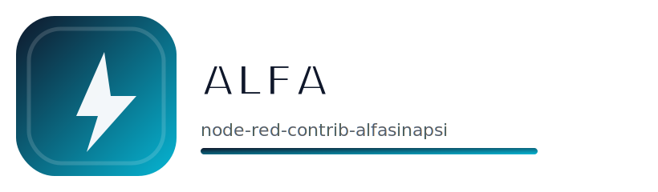
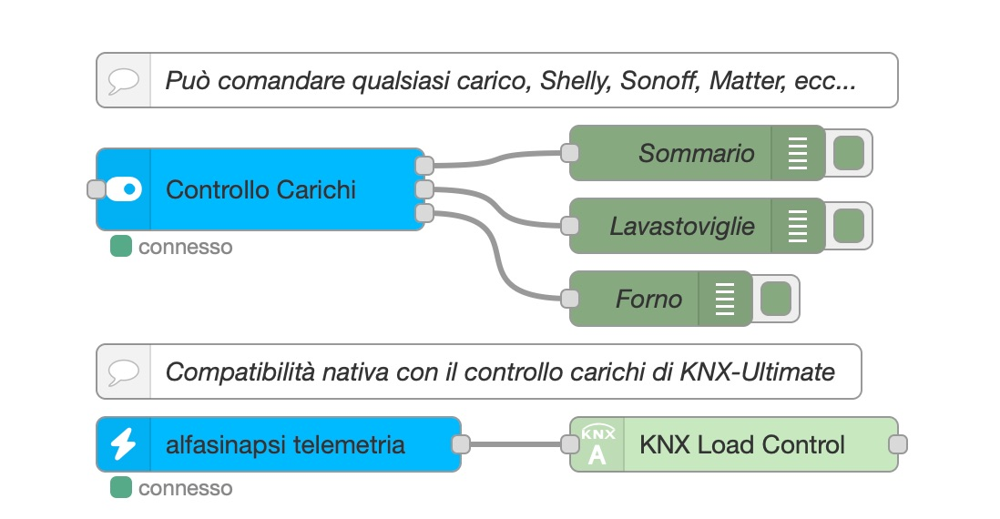

  

[![NPM version][npm-version-image]][npm-url]
[![Node.js version][node-version-image]][npm-url]
[![Node-RED Flow Library][flows-image]][flows-url]
[![Docs][docs-image]][docs-url]
[![NPM downloads per month][npm-downloads-month-image]][npm-url]
[![NPM downloads total][npm-downloads-total-image]][npm-url]
[![MIT License][license-image]][license-url]
[![JavaScript Style Guide][standard-image]][standard-url]
[![Youtube][youtube-image]][youtube-url]

Nodi Node-RED per collegare **Sinapsi Alfa** via WiFi e creare un **controller carichi**.

## Video YouTube

[Guarda il video](https://youtu.be/R-7PZv3iJ2s)

  

## Requisiti

- Un dispositivo Sinapsi Alfa raggiungibile sulla tua rete WiFi

## CHANGELOG

[CHANGELOG](changelog.md)

## Avvio rapido (passo-passo)

1. Apri l'editor di Node-RED.
2. Nella palette a sinistra, cerca "alfasinapsi".
3. Trascina **alfasinapsi telemetria** nel flow.
4. Fai doppio click e premi la **matita** vicino a _Dispositivo_ per creare una nuova configurazione **alfasinapsi device**.
5. Compila:
   - **Indirizzo IP Sinapsi**: l'indirizzo IP del tuo Sinapsi Alfa (esempio `192.168.1.186`)
6. Premi **Add**, poi **Done**.
7. Collega l'uscita del nodo telemetria a un nodo **Debug** e premi **Deploy**.

Dovresti vedere i messaggi nella sidebar di debug con valori di potenza ed energia.

  

Esempio `examples/alfasinapsi-load-controller.json`.

## Nodi

### 1) `alfasinapsi-device` (nodo di configurazione)

Questo nodo non appare nel flow come un nodo normale. E' una configurazione condivisa usata dagli altri nodi.

Campo principale:

- **Indirizzo IP Sinapsi**: indirizzo IP o hostname del dispositivo Sinapsi Alfa

Impostazioni fisse (non modificabili):

- Il profilo di connessione e' fisso per stabilita (serve solo l'indirizzo IP).

### 2) `alfasinapsi-telemetry`

Questo nodo legge le misure ogni _Poll (ms)_ e invia messaggi dal suo unico output.

In piu:

- Ogni messaggio include `msg.status` (stato connessione corrente).
- Quando cambia lo stato di connessione, emette anche un messaggio dedicato con `msg.topic = "alfasinapsi/telemetry/status"`.

Puoi scegliere cosa emettere dall'output con <i>Compatibilita</i>:

- <b>Telemetria</b> (consigliato): misure semplificate + dettagli tecnici.
- <b>KNX Load Control PIN</b>: messaggio `shed/unshed` (utile se lo colleghi a un nodo KNX Load Control).

Uso tipico:

- Collegalo a un nodo **Debug** per vedere i valori.
- Collegalo a una **Dashboard** (o alla tua logica) per visualizzare o usare potenza/energia.

Struttura del messaggio (modalita <b>Telemetria</b>):

- `msg.payload` - campi semplificati per l'uso quotidiano:
  - `payload.power.importkW` / `exportkW` / `productionkW` / `consumptionKW` / `surplusKW`
  - `payload.utilityPercent.selfConsumption` / `gridSale` / `gridPurchase`
  - `payload.energy.importTotalkWh` / `exportTotalkWh` / `productionTotalkWh`
  - `payload.tariffBand`
  - `payload.cutoff.hasWarning` / `payload.cutoff.remainingSeconds` / `payload.cutoff.atIso`
  - `payload.messageAtIso` / `payload.meterReadAtIso`
- `msg.insight` - dettagli tecnici:
  - `insight.telemetry`: telemetria completa decodificata (include campi extra come fasce di ieri, medie di quarto d'ora, ecc.)
  - `insight.power`: valori comodi in watt (`consumptionW`, `surplusW`)
- `msg.status` - stato connessione:
  - `status.connected` (boolean)
  - `status.connecting` (boolean)
  - `status.error` (string|null)
  - `status.ts` (number, epoch ms)

Struttura del messaggio (modalita <b>KNX Load Control PIN</b>):

- `msg.payload = "shed"` se e' presente un avviso distacco imminente, altrimenti `msg.payload = "unshed"`
- `msg.shedding` con lo stesso valore

## Terminologia (import/export/surplus)

Termini usati nel payload:

- **Import**: stai acquistando energia dalla rete.
- **Export**: stai vendendo energia alla rete.
- **Production**: stai producendo energia (es. fotovoltaico).
- **Consumo (casa)**: consumo istantaneo totale della casa (`payload.power.consumptionKW`).
- **Surplus**: potenza in eccesso disponibile; in questo pacchetto coincide con **Export** (`payload.power.surplusKW`).
- **Percentuali utili** (`payload.utilityPercent`, 0..100):
  - `selfConsumption`: quanta parte della produzione stai usando in casa
  - `gridSale`: quanta parte della produzione stai vendendo
  - `gridPurchase`: quanta parte del consumo arriva dalla rete

### 3) `alfasinapsi-load-controller`

Questo nodo <b>non fa polling</b>. Riceve in ingresso messaggi <b>Telemetria</b> (output del nodo <code>alfasinapsi-telemetry</code> in modalita <i>Telemetria</i>) e usa <code>payload.cutoff.hasWarning</code> per decidere se spegnere o riaccendere i carichi, uno alla volta, seguendo l'ordine della lista. Invia:

- Una uscita per ogni carico configurato, che emette <code>true/false</code> (unshed/shed) con <code>msg.topic</code> uguale al nome del carico.

Importante: questo nodo **non comanda i relè da solo**. Devi collegare ogni uscita carico a qualcosa che accende/spegne davvero i dispositivi (per esempio MQTT, nodi Shelly, chiamate di servizio Home Assistant, ecc.).

Nota: il controller cambia un carico alla volta; la velocita dipende da quanto spesso arrivano messaggi dalla telemetria (<i>Poll</i>).

Come configurare i carichi:

- **Nome**: usato come etichetta di uscita e come `msg.topic` in output
- **Ordine in lista**: la posizione nella lista determina la priorita (dall'alto verso il basso)
- **Min acceso (s)**: tempo minimo in cui il carico resta acceso prima di poter essere spento
- **Min spento (s)**: tempo minimo in cui il carico resta spento prima di poter essere acceso

## Problemi di connessione? Ricorda

- Sinapsi Alfa in genere accetta una sola connessione alla volta: evita di collegare piu sistemi contemporaneamente.

[npm-version-image]: https://img.shields.io/npm/v/node-red-contrib-alfasinapsi-ultimate.svg
[npm-url]: https://www.npmjs.com/package/node-red-contrib-alfasinapsi-ultimate
[node-version-image]: https://img.shields.io/node/v/node-red-contrib-alfasinapsi-ultimate.svg
[flows-image]: https://img.shields.io/badge/Node--RED-Flow%20Library-red
[flows-url]: https://flows.nodered.org/node/node-red-contrib-alfasinapsi-ultimate
[docs-image]: https://img.shields.io/badge/docs-documents-blue
[docs-url]: documents/
[npm-downloads-month-image]: https://img.shields.io/npm/dm/node-red-contrib-alfasinapsi-ultimate.svg
[npm-downloads-total-image]: https://img.shields.io/npm/dt/node-red-contrib-alfasinapsi-ultimate.svg
[license-image]: https://img.shields.io/badge/license-MIT-green.svg
[license-url]: https://opensource.org/licenses/MIT
[standard-image]: https://img.shields.io/badge/code%20style-standard-brightgreen.svg
[standard-url]: https://standardjs.com
[youtube-image]: https://img.shields.io/badge/YouTube-Subscribe-red?logo=youtube&logoColor=white
[youtube-url]: https://www.youtube.com/@Supergiovane
